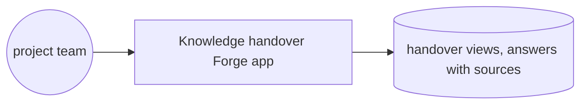

# Codegeist 2026 · architecture

**Status:** Active · **Updated:** 2026-11-01 by /shape onboarding

## Context

```mermaid
flowchart LR
    U((project team)) --> P[Knowledge handover Forge app] --> O[(handover views, answers with sources)]
```

## Components

none yet
